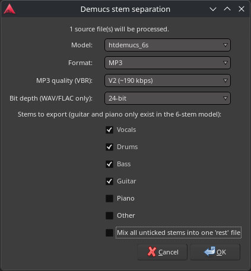

# ardour-demucs-stem-separation

Lua script for Ardour to do stem separation via the [demucs](https://pypi.org/project/demucs) Python library on Linux.

Select one or more audio regions, run the script, and it splits each source file into stems (vocals, drums, bass, guitar, piano, other) in the background. When finished you get a desktop notification and the stems folder opens in your file manager, ready to drag into Ardour.



## Requirements

- Ardour (with Lua scripting support — included in official builds)
- ffmpeg (stereo merge and format conversion)
- demucs (installed via `uv`, see below)
- Optional: `diffq` (required for the quantized `mdx_q` / `mdx_extra_q` models, see below)
- Optional: `notify-send` (libnotify) for desktop notifications

## Installing dependencies

### CachyOS / Arch Linux

```sh
sudo pacman -S ffmpeg uv libnotify
```

Then install demucs with `uv`. Pick the variant matching your hardware:

**AMD GPU (ROCm):**

```sh
uv tool install --force --with numpy --torch-backend=rocm7.2 demucs
```

**Nvidia GPU (CUDA):**

```sh
uv tool install --force --with numpy --torch-backend=cu132 demucs
```

**CPU only:**

```sh
uv tool install --force --with numpy --torch-backend=cpu demucs
```

> **Note:** `--with numpy` is required — demucs needs numpy but does not pull it in automatically.

### Ubuntu

```sh
sudo apt install ffmpeg libnotify-bin curl
curl -LsSf https://astral.sh/uv/install.sh | sh
```

Then install demucs with `uv`, picking the variant matching your hardware:

**Nvidia GPU (CUDA):**

```sh
uv tool install --force --with numpy --torch-backend=cu128 demucs
```

**CPU only:**

```sh
uv tool install --force --with numpy --torch-backend=cpu demucs
```

**AMD GPU (ROCm):**

```sh
uv tool install --force --with numpy --torch-backend=rocm7.2 demucs
```

> **Note:** ROCm on Ubuntu requires a working ROCm installation for your GPU; if in doubt, use the CPU variant.

### Verifying the installation

`uv tool install` places the `demucs` binary in `~/.local/bin`. Make sure it works:

```sh
~/.local/bin/demucs --help
```

The script checks `~/.local/bin/demucs` first, so it works even when Ardour is launched from a desktop icon that does not have `~/.local/bin` in its `PATH`.

### Quantized models (mdx_q, mdx_extra_q)

The quantized models additionally need the `diffq` Python package — without it, demucs fails with "Trying to use DiffQ, but diffq is not installed." Reinstall demucs with `diffq` added (use the same `--torch-backend` as in your original install):

```sh
uv tool install --force --with numpy --with diffq --torch-backend=cpu demucs
```

## Installing the script in Ardour

1. Copy [demucs_stem_separation.lua](demucs_stem_separation.lua) to Ardour's script folder:

   ```sh
   mkdir -p ~/.config/ardour9/scripts
   cp demucs_stem_separation.lua ~/.config/ardour9/scripts/
   ```

   (Replace `ardour9` with your Ardour version's config folder, e.g. `ardour10`.)

2. Restart Ardour.

3. The script appears under **Edit → Lua Scripts → Script Manager** (or directly in the **Edit → Lua Scripts** menu, depending on version) as **Demucs Stem Separation**. You can also bind it to a keyboard shortcut via **Preferences → Shortcuts**.

## Usage

1. Select one or more audio regions in the editor.
2. Run the script.
3. Choose the model, output format (MP3/FLAC/WAV), and which stems to export.
4. The separation runs in the background. When it finishes you get a notification and the stems folder opens — drag the stems into your session.

Stems are written to `<session>/demucs/run_<timestamp>/stems/`. Logs (`run.log`, `trace.log`, `demucs.log`) are kept in the same run folder for troubleshooting. If the separation fails, the failure notification includes the relevant error lines extracted from the log.

## License

GPLv3 — see [LICENSE](LICENSE).
